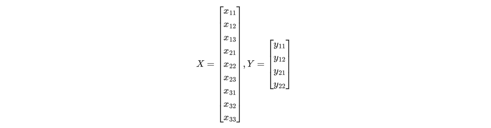

# 卷积算子

**卷积核（kernel）**：也被叫做滤波器（filter），假设卷积核的高和宽分别为𝑘ℎ和𝑘𝑤，则将称为𝑘ℎ×𝑘𝑤卷积，比如3×5卷积，就是指卷积核的高为3, 宽为5。卷积核中数值为对图像中与卷积核同样大小的子块像素点进行卷积计算时所采用的权重。

**卷积计算（convolution）**图像中像素点具有很强的空间依赖性，卷积（convolution）就是针对像素点的空间依赖性来对图像进行处理的一种技术。

**特征图（feature map）**：卷积滤波结果在卷积神经网络中被称为特征图（feature map）。

在卷积神经网络中，卷积层的实现方式实际上是数学中定义的互相关 （cross-correlation）运算，具体的计算过程如 下图所示，每张图的左图表示输入数据是一个维度为3 x 3的二维数组；中间的图表示卷积核是一个维度为2 x 2的二维数组。

卷积核的计算过程可以用下面的数学公式表示，其中 𝑎 代表输入图片， 𝑏 代表输出特征图，𝑤是卷积核参数，它们都是二维数组，∑𝑢,𝑣 表示对卷积核参数进行遍历并求和。

𝑏[𝑖,𝑗]=∑𝑢,𝑣𝑎[𝑖+𝑢,𝑗+𝑣]⋅𝑤[𝑢,𝑣]

## 2D卷积conv2d

**输入多通道**

上面的例子中，卷积层的数据是一个2维数组，但实际上一张图片往往含有RGB三个通道，要计算卷积的输出结果，卷积核的形式也会发生变化。假设输入图片的通道数为3，输入数据的形状是3×𝐻𝑖𝑛×𝑊𝑖𝑛，计算过程如图 所示。

1. 对每个通道分别设计一个2维数组作为卷积核，卷积核数组的形状是3×𝑘ℎ×𝑘𝑤。
2. 对任一通道𝑐𝑖𝑛∈[0,3)，分别用大小为𝑘ℎ×𝑘𝑤的卷积核在大小为𝐻𝑖𝑛×𝑊𝑖𝑛的二维数组上做卷积。
3. 将这3个通道的计算结果相加，得到的是一个形状为𝐻𝑜𝑢𝑡×𝑊𝑜𝑢𝑡的二维数组。

**输出多通道**

假设输入图片的通道数为3，我们希望检测2种类型的特征，这时我们需要设计2个维度为3×𝑘ℎ×𝑘𝑤的卷积核，卷积核数组的维度是2×3×𝑘ℎ×𝑘𝑤，如下图所示。

1. 对任一输出通道𝑐𝑜𝑢𝑡∈[0,2)，分别使用上面描述的形状为3×𝑘ℎ×𝑘𝑤的卷积核对输入图片做卷积。
2. 将这2个形状为𝐻𝑜𝑢𝑡×𝑊𝑜𝑢𝑡的二维数组拼接在一起，形成维度为2×𝐻𝑜𝑢𝑡×𝑊𝑜𝑢𝑡2的三维数组。

**多batch卷积**

在卷积神经网络的计算中，通常将多个样本放在一起形成一个mini-batch进行批量操作，即输入数据的维度是𝑁×𝐶𝑖𝑛×𝐻𝑖𝑛×𝑊𝑖𝑛。由于会对每张图片使用同样的卷积核进行卷积操作，卷积核的维度是𝐶𝑜𝑢𝑡×𝐶𝑖𝑛×𝑘ℎ×𝑘𝑤，那么，输出特征图的维度就是𝑁×𝐶𝑜𝑢𝑡×𝐻𝑜𝑢𝑡×𝑊𝑜𝑢𝑡。

**步长stride**

在卷积操作时，通常希望输出图像分辨率与输入图像分辨率相比会逐渐减少，即图像被约减。因此，可以通过改变卷积核在输入图像中移动步长大小来跳过一些像素，进行卷积滤波。当Stride=1时，卷积核滑动跳过1个像素，这是最基本的单步滑动，也是标准的卷积模式。Stride=k表示卷积核移动跳过的步长是k。

下图是步长为2的卷积过程，卷积核在图片上移动时，每次移动大小为2个像素点。

当高和宽方向的步幅分别为𝑠ℎsh和𝑠𝑤sw时，输出特征图尺寸的计算公式是：

𝐻𝑜𝑢𝑡=(𝐻+2𝑝ℎ−𝑘ℎ)/𝑠ℎ+1

𝑊𝑜𝑢𝑡=(𝑊+2𝑝𝑤−𝑘𝑤)𝑠𝑤+1

**填充padding**

输入图像边缘位置的像素点无法进行卷积滤波，为了使边缘像素也参与卷积滤波，填充技术应运而生。填充是指在边缘像素点周围填充“0”（即0填充），使得输入图像的边缘像素也可以参与卷积计算。注意，在这种填充机制下，卷积后的图像分辨率将与卷积前图像分辨率一致，不存在下采样。

- 左图中填充的大小为1，填充值为0。填充之后，输入图片尺寸从4×4变成了6×6，使用3×3的卷积核，输出图片尺寸为4×4。
- 右图中填充的大小为2，填充值为0。填充之后，输入图片尺寸从4×4变成了8×8，使用3×3的卷积核，输出图片尺寸为6×6。

如果在输入图片第一行之前填充𝑝ℎ1行，在最后一行之后填充𝑝ℎ2行；在图片第1列之前填充𝑝𝑤1列，在最后1列之后填充𝑝𝑤2列；则填充之后的图片尺寸为(𝐻+𝑝ℎ1+𝑝ℎ2)×(𝑊+𝑝𝑤1+𝑝𝑤2)。经过大小为𝑘ℎ×𝑘𝑤的卷积核操作之后，输出图片的尺寸为：

𝐻𝑜𝑢𝑡=𝐻+𝑝ℎ1+𝑝ℎ2−𝑘ℎ+1

𝑊𝑜𝑢𝑡=𝑊+𝑝𝑤1+𝑝𝑤2−𝑘𝑤+1

在卷积计算过程中，通常会在高度或者宽度的两侧采取等量填充，即𝑝ℎ1=𝑝ℎ2=𝑝ℎ, 𝑝𝑤1=𝑝𝑤2=𝑝𝑤，上面计算公式也就变为：

𝐻𝑜𝑢𝑡=𝐻+2𝑝ℎ−𝑘ℎ+1

𝑊𝑜𝑢𝑡=𝑊+2𝑝𝑤−𝑘𝑤+1

为了便于padding，卷积核大小通常使用1，3，5，7这样的奇数，这样如果使用的填充大小为𝑝ℎ=(𝑘ℎ−1)/2，𝑝𝑤=(𝑘𝑤−1)/2，则可以使得卷积之后图像尺寸不变。例如当卷积核大小为3时，padding大小为1，卷积之后图像尺寸不变；同理，如果卷积核大小为5，padding大小为2，也能保持图像尺寸不变。

**Dilation**

对于一个尺寸为 3×3的标准卷积，卷积核大小为 3×3 ，卷积核上共包含9个参数，在卷积计算时，卷积核中的元素会与输入矩阵上对应位置的元素进行逐像素的乘积并求和。而空洞卷积与标准卷积相比，多了扩张率这一个参数，扩张率控制了卷积核中相邻元素间的距离，扩张率的改变可以控制卷积核感受野的大小。尺寸为 3×3，扩张率分别为 1,2,4时的空洞卷积分别如下面三张图所示。

**Group**

分组卷积（Group Convolution）最早出现在AlexNet中。受限于当时的硬件资源，在AlexNet网络训练时，难以把整个网络全部放在一个GPU中进行训练，因此，作者将卷积运算分给多个GPU分别进行计算，最终把多个GPU的结果进行融合。因此分组卷积的概念应运而生。

对于尺寸为 𝐻1×𝑊1×𝐶1的输入矩阵，当标准卷积核的尺寸为 ℎ1×𝑤1×𝐶1 ，共有 𝐶2个标准卷积核时，标准卷积会对完整的输入数据进行运算，最终得到的输出矩阵尺寸为 𝐻2×𝑊2×𝐶2。这里我们假设卷积运算前后的特征图尺寸保持不变，则上述过程可以展示为下图。

分组卷积中，通过指定组数 𝑔g 来确定分组数量，将输入数据分成 𝑔 组。需要注意的是，这里的分组指的是在深度上进行分组，输入的宽和高保持不变，即将每 𝐶1/𝑔个通道的数据分为一组。因为输入数据发生了改变，相应的卷积核也需要进行对应的变化，即每个卷积核的输入通道数也就变为了 𝐶1/𝑔，而卷积核的大小是不需要改变的。同时，每组的卷积核个数也由原来的 𝐶2 变为 𝐶2/𝑔 。对于每个组内的卷积运算，同样采用标准卷积运算的计算方式，这样就可以得到 𝑔组尺寸为 𝐻2×𝑊2×𝐶2/𝑔的输出矩阵，最终将这 𝑔g 组输出矩阵进行拼接就可以得到最终的结果。这样拼接完成后，最终的输出尺寸就可以保持不变，仍然是 𝐻2×𝑊2×𝐶2。分组卷积的运算过程如下图 所示。

由于我们将整个标准卷积过程拆分成了 𝑔g 组规模更小的子运算来并行进行，所以最终降低了对运行设备的要求。同时，通过分组卷积的方式，参数量也可以得到降低。在上述的标准卷积中，参数量为：

而使用分组卷积后，参数量则变为：

## 转置卷积conv2d_transpose/deconvolution/conv2d_backprop_input

**conv2d_transpose**

拿之前的普通卷积的例子来看，输入矩阵右上角2x2的值会影响输出矩阵中右上角的值，我们可以说2×2的标准卷积核建立了输入矩阵中4个值与输出矩阵中1个值的对应关系。

对于转置卷积而言，我们实际上是想建立一个逆向操作，也就是建立一个一对多的关系。对于上边的例子，我们想要建立的其实是输出卷积中的1个值与输入卷积中的4个值的关系。当然，从信息论的角度，卷积操作是不可逆的，**所以转置卷积并不是使用输出矩阵和卷积核计算原始的输入矩阵，而是计算得到保持了相对位置关系的矩阵**。

**公式推导**

这里，我们换一个表达方式，我们将输入矩阵 𝑖𝑛𝑝𝑢𝑡和输出矩阵 𝑜𝑢𝑡𝑝𝑢𝑡展开成列向量𝑋 和列向量𝑌，那么向量𝑋 和向量𝑌的尺寸就分别是9×1和4×1，可以分别用如下矩阵表示：

我们再用矩阵运算来描述标准卷积运算，这里使用矩阵𝐶来表示新的卷积核矩阵：

𝑌 = 𝐶𝑋

经过推导，我们可以得到这个稀疏矩阵𝐶，它的尺寸为4×9：

而转置卷积其实就是要对这个过程进行逆运算，即通过 𝐶和 𝑌 得到 𝑋：

此时，新的稀疏矩阵就变成了尺寸为9×4 ，用来进行转置卷积的权重矩阵不一定来自于原卷积矩阵. 只是权重矩阵的形状和转置后的卷积矩阵相同。

带入提到的矩阵运算，则转置卷积的计算结果为：

等价于卷积运算

**conv2d_backprop_input**

卷积反向计算的是神经网络反向传播时input的梯度，可以通过输出的梯度和filter做卷积运算得到。

**公式推导**

用下面的矩阵表示卷积正向时的数据变换

则输出的各个像素点的计算为

根据链式法则，如果已知输出的梯度，可以得到输入的梯度

梯度求解可以用下图的矩阵乘法来表示

观察发现，y的梯度和卷积核的卷积运算展开后刚好是上图的矩阵乘法，卷积核转置逆序

因此通常卷积反向的梯度传播，也是用卷积的计算公式来实现的

**conv2d_backprop_filter**

除了对输入的梯度，反向传播时最重要的是计算filter的梯度，可以通过输出的梯度和输入做卷积运算得到。

**公式推导**

输出各个像素点的计算为

梯度求解可以用下图的矩阵乘法来表示

## depthwise_conv2d

depthwise卷积输入的每个channel只和filter对应的单个channel做卷积运算，然后按照每个卷积核的通道顺序拼接出结果，举例来说

先计算输入的第一个通道和第一个卷积核的第一个通道的卷积结果

再计算输入的第一个通道和第二个卷积核的第一个通道的卷积结果

再计算输入的第一个通道和第三个卷积核的第一个通道的卷积结果，然后依次计算输入的第二个通道和三个卷积核的第二个通道